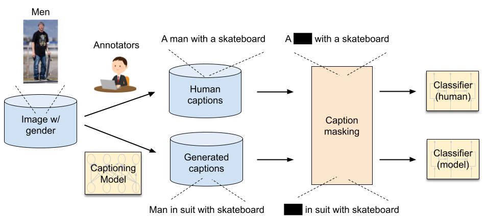

# Quantifying Societal Bias Amplification in Image Captioning
This repository contains source code necessary to reproduce the results presented in the paper [Quantifying Societal Bias Amplification in Image Captioning](https://openaccess.thecvf.com/content/CVPR2022/html/Hirota_Quantifying_Societal_Bias_Amplification_in_Image_Captioning_CVPR_2022_paper.html) (CVPR 2022, Oral). Please check the project website [here](https://sites.google.com/view/cvpr-2022-quantify-bias/home).

## Introduction
We study societal bias amplification in image captioning. We propose LIC, a metric to study captioning bias amplification.

The classifier is trained to predict the attributes of the person in the image.

Attribute-revealing words are masked before being fed into the classifier.

To compute bias amplification, compare the accuracies of the 2 classifiers. 

## Setup
1. Clone the repository.
2. Download the [data](https://drive.google.com/drive/folders/1PI03BqcnhdXZi2QY9PUHzWn4cxgdonT-?usp=sharing) (folder name: bias_data) and place in the current directory.
  The folder contains human/generated captions and corresponding gender/racial annotations from the paper [Understanding and Evaluating Racial Biases in Image Captioning](https://openaccess.thecvf.com/content/ICCV2021/html/Zhao_Understanding_and_Evaluating_Racial_Biases_in_Image_Captioning_ICCV_2021_paper.html).   
3. Install dependancies:

  ### For LSTM classifier
    - Python 3.7
    - numpy 
    - pytorch 1.9
    - torchtext 0.10.0 
    - spacy 
    - sklearn 
  ### For BERT classifier
    - Python 3.7
    - numpy
    - pytorch 1.4
    - transformers 4.0.1
    - spacy 2.3
    - sklearn
    
## Evaluation
1. train the classifier on human/generated captions. 
2. calculate LIC on human/generated captions.

- To train the **LSTM** classifier on **human captions** and compute LIC in terms of **gender** bias run:
    
  `python lstm_leakage.py --seed $int --cap_model $model_name --calc_ann_leak True`
    
  Where `$int` is the arbitrary integer for random seed and `$model_name` is the choice of a captioning model to be compared (i.e. `nic`, `sat`, `fc`, `att2in`, `updn`, `transformer`, `oscar`, `nic_equalizer`, or `nic_plus`).

- To train the **LSTM** classifier on **generated captions** and compute LIC in terms of **gender** bias run:
    
  `python lstm_leakage.py --seed $int --cap_model $model_name --calc_model_leak True`
    
  Where `$model_name` is the choice of a captioning model  (i.e. `nic`, `sat`, `fc`, `att2in`, `updn`, `transformer`, `oscar`, `nic_equalizer`, or `nic_plus`). 
  
- To train the **BERT** classifier on **human captions** and compute LIC in terms of **gender** bias run:
    
  `python bert_leakage.py --seed $int --cap_model $model_name --calc_ann_leak True`
    
- To train the **BERT** classifier on **generated captions** and compute LIC in terms of **gender** bias run:
    
  `python bert_leakage.py --seed $int --cap_model $model_name --calc_model_leak True`

**Note**: If you compute LIC in terms of **racial** bias, please run `race_lstm_leakage.py` or `race_bert_leakage.py`.
  
**Note**: To avoid updating BERT parameters, you can add `--freeze_bert True`, `--num_epochs 20`, and `--learning_rate 5e-5` 
  
  
    
## Results

## Citation
    @inproceedings{hirota2022quantifying,
      title={Quantifying Societal Bias Amplification in Image Captioning},
      author={Hirota, Yusuke and Nakashima, Yuta and Garcia, Noa},
      booktitle={Proceedings of the IEEE/CVF Conference on Computer Vision and Pattern Recognition},
      pages={13450--13459},
      year={2022}
     }
