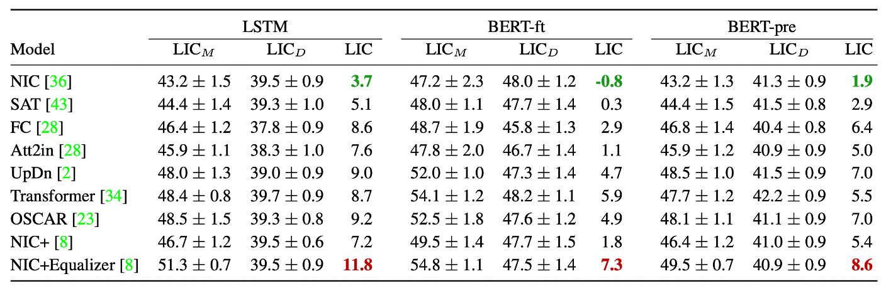

# Quantifying Societal Bias Amplification in Image Captioning
This repository contains source code necessary to reproduce the results presented in the paper [Quantifying Societal Bias Amplification in Image Captioning](https://openaccess.thecvf.com/content/CVPR2022/html/Hirota_Quantifying_Societal_Bias_Amplification_in_Image_Captioning_CVPR_2022_paper.html) (CVPR 2022, Oral). Please check the project website [here](https://sites.google.com/view/cvpr-2022-quantify-bias/home).

## LIC metric
1. Mask attribute-revealing words. 
2. Train 2 classifiers on human/generated captions to predict the attributes of the person in the image.
3. Calculate LIC scores for each classifier. 
4. To compute bias amplification, take the difference of the LIC socres between 2 classifiers.

## Setup
1. Clone the repository.
2. Download the [data](https://drive.google.com/drive/folders/13AUAnpvy_4DoEyh_6DVG1EfJg2b0f6_k?usp=sharing) (folder name: bias_data) and place in the current directory.
3. Install dependancies:
  ### For LSTM classifier
    - Python 3.7
    - numpy 
    - pytorch 1.9
    - torchtext 0.10.0 
    - spacy 
    - sklearn 
  ### For BERT classifier
    - Python 3.7
    - numpy
    - pytorch 1.4
    - transformers 4.0.1
    - spacy 2.3
    - sklearn
    
## Compute LIC  

  ### For LSTM classifier
    For training the classifier and calculating LIC on human captions in terms of gender bias.   
    - sh run_gender_lstm_ann.sh 
    
    For training the classifier and calculating LIC on generated captions in terms of gender bias.
    - sh run_gender_lstm_model.sh 
    
    For training the classifier and calculating LIC on human captions in terms of racial bias.
    - sh run_race_lstm_ann.sh 
    
    For training the classifier and calculating LIC on generated captions in terms of racial bias.
    - sh run_race_lstm_model.sh 
    
  ### For BERT classifier
    For training the classifier and calculating LIC on human captions in terms of gender bias. 
    - sh run_gender_bert_ann.sh 
    
    For training the classifier and calculating LIC on generated captions in terms of gender bias.
    - sh run_gender_bert_model.sh 
    
    For training the classifier and calculating LIC on human captions in terms of racial bias.
    - sh run_race_bert_ann.sh 
    
    For training the classifier and calculating LIC on generated captions in terms of racial bias.
    - sh run_race_bert_model.sh 
    
  ### For BERT classifier (BERT is not finetuned)
    For training the classifier and calculating LIC on human captions in terms of gender bias. 
    - sh run_gender_bert_freeze_ann.sh 
    
    For training the classifier and calculating LIC on generated captions in terms of gender bias.
    - sh run_gender_bert_freeze_model.sh 
    
    For training the classifier and calculating LIC on human captions in terms of racial bias.
    - sh run_race_bert_freeze_ann.sh 
    
    For training the classifier and calculating LIC on generated captions in terms of racial bias.
    - sh run_race_bert_freeze_model.sh 

**Note**: The classifier is trained 10 times with random initializations, and the results are reported by the average and standard deviation.
    
## Results

### Gender bias

### Racial bias

## Citation
    @inproceedings{hirota2022quantifying,
      title={Quantifying Societal Bias Amplification in Image Captioning},
      author={Hirota, Yusuke and Nakashima, Yuta and Garcia, Noa},
      booktitle={Proceedings of the IEEE/CVF Conference on Computer Vision and Pattern Recognition},
      pages={13450--13459},
      year={2022}
     }
