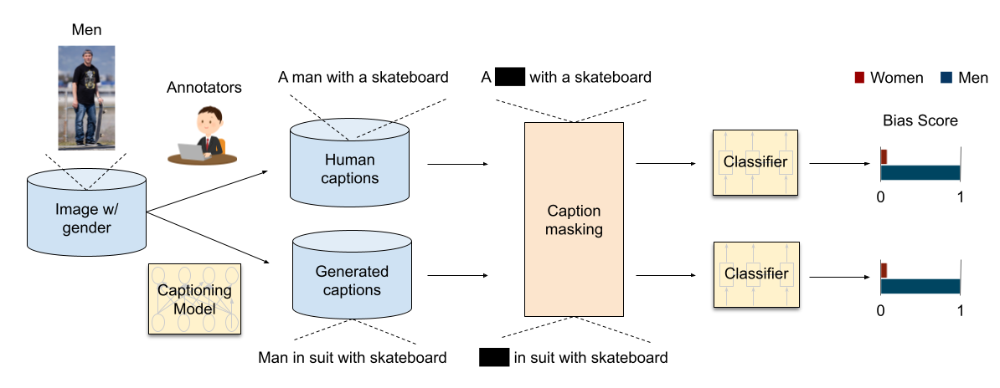

# Quantifying Societal Bias Amplification in Image Captioning
This repository contains source code necessary to reproduce the results presented in the paper [Quantifying Societal Bias Amplification in Image Captioning](https://openaccess.thecvf.com/content/CVPR2022/html/Hirota_Quantifying_Societal_Bias_Amplification_in_Image_Captioning_CVPR_2022_paper.html) (CVPR 2022, Oral). Please check the project website [here](https://sites.google.com/view/cvpr-2022-quantify-bias/home).

## LIC metric
LIC metric measures how much biased a set of model generated captions are with respect to the captions in the training dataset. LIC is computer as follows:

1. Mask attribute-revealing words. 
    

2. Train 2 classifiers, 1 for human captions and 1 for generated captions, with attribute labels. The classifiers' goal is to predict the attribute (e.g. gender, race) for the person in the image **using only the captions**.

3. Calculate LIC scores for each classifier. If the set of captions is not biased, the classifier accuracy should be close to random chance.

4. To compute bias amplification, take the difference of the LIC socres between 2 classifiers.

## Setup
1. Clone the repository.
2. Download the [data](https://drive.google.com/drive/folders/1PI03BqcnhdXZi2QY9PUHzWn4cxgdonT-?usp=sharing) (folder name: bias_data) and place in the current directory.
  The folder contains human/generated captions and corresponding gender/racial annotations from the paper [Understanding and Evaluating Racial Biases in Image Captioning](https://github.com/princetonvisualai/imagecaptioning-bias).
3. Install dependancies:
  ### For LSTM classifier
    - Python 3.7
    - numpy 1.21.2 
    - pytorch 1.9
    - torchtext 0.10.0 
    - spacy 3.4.0 
    - sklearn 1.0.2 
    - nltk 3.6.3

  ### For BERT classifier
    - Python 3.7
    - numpy 1.21.2 
    - pytorch 1.4
    - transformers 4.0.1
    - spacy 2.3
    - sklearn 1.0.2 
    - nltk 3.6.3
    
## Compute LIC  
We evaluate various captioning models (i.e. [NIC](https://arxiv.org/abs/1411.4555), [SAT](https://github.com/sgrvinod/a-PyTorch-Tutorial-to-Image-Captioning), [FC](https://github.com/ruotianluo/self-critical.pytorch), [Att2in](https://github.com/ruotianluo/self-critical.pytorch), [UpDn](https://github.com/ruotianluo/self-critical.pytorch/blob/master/MODEL_ZOO.md), [Transformer](https://github.com/ruotianluo/self-critical.pytorch/blob/master/MODEL_ZOO.md), [OSCAR](https://github.com/microsoft/Oscar), [NIC+](https://github.com/kayburns/women-snowboard), and [NIC+Equalizer](https://github.com/kayburns/women-snowboard)). In the following commands, you can select a model in `$model_name` from them (i.e. `nic`, `sat`, `fc`, `att2in`, `updn`, `transformer`, `oscar`, `nic_equalizer`, or `nic_plus`).

In the paper, LSTM or BERT is used as the classifier. Please run the following commands according to the classifier you prefer to use.

 

- To train the **LSTM** classifier on **human captions** and compute LIC in terms of **gender** bias run:
    
  `python3 lstm_leakage.py --seed $int --cap_model $model_name --calc_ann_leak True`
    
  Where `$int` is the arbitrary integer for random seed and `$model_name` is the choice of a captioning model to be compared.

 

- To train the **LSTM** classifier on **generated captions** and compute LIC in terms of **gender** bias run:
    
  `python3 lstm_leakage.py --seed $int --cap_model $model_name --calc_model_leak True`
    
  Where `$model_name` is the choice of a captioning model. 
  
 

- To train the **BERT** classifier on **human captions** and compute LIC in terms of **gender** bias run:
    
  `python3 bert_leakage.py --seed $int --cap_model $model_name --calc_ann_leak True`
    
 

- To train the **BERT** classifier on **generated captions** and compute LIC in terms of **gender** bias run:
    
  `python3 bert_leakage.py --seed $int --cap_model $model_name --calc_model_leak True`

 

**Note**: If you compute LIC in terms of **racial** bias, please run `race_lstm_leakage.py` or `race_bert_leakage.py`.
  
**Note**: To use pre-trained BERT without fine-tuning, you can add `--freeze_bert True`, `--num_epochs 20`, and `--learning_rate 5e-5`. 
  

## Results

### Gender bias

### Racial bias

**Note**: The classifier is trained 10 times with random initializations, and the results are reported by the average and standard deviation.

## Citation
    @inproceedings{hirota2022quantifying,
      title={Quantifying Societal Bias Amplification in Image Captioning},
      author={Hirota, Yusuke and Nakashima, Yuta and Garcia, Noa},
      booktitle={Proceedings of the IEEE/CVF Conference on Computer Vision and Pattern Recognition},
      pages={13450--13459},
      year={2022}
     }
